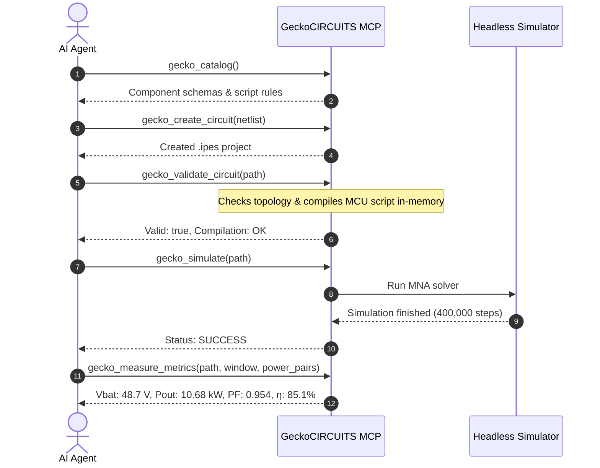

# GeckoCIRCUITS Model Context Protocol (MCP) Interface

GeckoCIRCUITS ships a native [Model Context Protocol (MCP)](https://modelcontextprotocol.io) server that enables AI and LLM agents — such as Google Antigravity, Claude Desktop, Cursor, and GitHub Copilot — to autonomously design, inspect, validate, simulate, and tune power electronics circuits without opening a GUI or inspecting simulator source code.

---

## Server Implementations

| Attribute | Bundled Production Server (Java) | Development Server (Python) |
|---|---|---|
| **Location** | `src/modules/gecko-mcp` | `tools/mcp/gecko_mcp` |
| **Packaging** | Shaded into `desktop/app/engine/gecko-mcp.jar` | Standalone Python module (`uv run`) |
| **Requirements** | Bundled Java 25 runtime (zero external dependencies) | Python 3 + `uv`, JDK 25 for engine |
| **Transports** | `stdio` | `stdio`, `sse`, `streamable-http` |
| **Simulation** | In-process headless simulation engine (`GeckoHeadless`) | Subprocess `java -cp … gecko.core.GeckoHeadless` |
| **Tools Exposed** | **13 tools** (full authoring, live DRC compilation, metrics) | 10 tools (template & simulation tools) |

The production Java server (`launch-mcp.py` / `gecko-mcp.jar`) is recommended for all LLM workflows because it executes simulations in-process, provides live microcontroller code compilation diagnostics, and synthesizes arbitrary circuit schematics from scratch.

---

## Client Configuration

### 1. Google Antigravity
The server is pre-configured in `.agents/mcp_config.json` for workspace use:
```json
{
  "mcpServers": {
    "gecko-circuits": {
      "command": "python",
      "args": [
        "scripts/desktop/launch-mcp.py"
      ]
    }
  }
}
```
Or in global Antigravity config (`~/.gemini/config/mcp_config.json`):
```json
{
  "mcpServers": {
    "gecko-circuits": {
      "command": "python",
      "args": [
        "C:/path/to/GeckoCIRCUITS/scripts/desktop/launch-mcp.py"
      ]
    }
  }
}
```

### 2. Claude Desktop
Add to `claude_desktop_config.json`:
```json
{
  "mcpServers": {
    "gecko-circuits": {
      "command": "python",
      "args": [
        "C:/path/to/GeckoCIRCUITS/scripts/desktop/launch-mcp.py"
      ]
    }
  }
}
```

### 3. Cursor
Add to `.cursor/mcp.json`:
```json
{
  "mcpServers": {
    "gecko-circuits": {
      "command": "python",
      "args": [
        "scripts/desktop/launch-mcp.py"
      ]
    }
  }
}
```

### 4. GitHub Copilot (VS Code Agent Mode)
Add to `.vscode/settings.json`:
```json
{
  "github.copilot.chat.mcp.servers": {
    "gecko-circuits": {
      "command": "python",
      "args": [
        "${workspaceFolder}/scripts/desktop/launch-mcp.py"
      ]
    }
  }
}
```

### 5. Desktop Application (Installed Package)
Run the launcher generator in your install directory:
```sh
python scripts/desktop/write-mcp-launchers.py --dest <install-dir>
```
It generates `gecko-mcp.bat` (Windows) or `gecko-mcp.sh` (Linux/macOS) which uses the bundled JRE directly. Point your MCP client to the generated `.bat` or `.sh`.

---

## Complete Tools Reference (13 Tools)

| Tool | Category | Description |
|---|---|---|
| `gecko_server_status` | System | Checks Java environment, engine health, and platform capabilities. |
| `gecko_catalog` | Discovery | Returns all placeable power/control components, parameter schemas, and embedded guides. |
| `gecko_create_circuit` | Authoring | **Universal schematic synthesizer**: builds complete `.ipes` circuits from a JSON netlist with collision-free layout. |
| `gecko_validate_circuit` | DRC & Diagnostics | **Design Rule Checker**: verifies connectivity, floating nodes, and performs **live compilation** of MCU script blocks. |
| `gecko_measure_metrics` | Analytics | **In-memory signal processor**: calculates DC average, ripple $\Delta V_{pp}$, RMS, power factor, power, and efficiency. |
| `gecko_setup_pfc_project` | Parametric | Generates a 2-phase interleaved boost PFC project with MCU script controller and dynamic load step. |
| `gecko_setup_llc_project` | Parametric | Generates a half-bridge resonant LLC converter with ZVS snubber and tank analytics ($f_0, Z_0, Q, k$). |
| `gecko_inspect_circuit` | Introspection | Parses an existing `.ipes` circuit, listing power parts, control blocks, wires, and simulation settings. |
| `gecko_patch_component` | Tuning | Modifies component parameters (e.g. `{"param0": 25.0}` on a resistor or inductor). |
| `gecko_set_script_code` | Controller | Updates the C/Java source code and static variables of a microcontroller script block. |
| `gecko_simulate` | Execution | Runs a headless simulation; returns step count, duration, and list of all logged signals. |
| `gecko_get_waveforms` | Waveforms | Runs a simulation and extracts downsampled time-series waveform arrays. |
| `gecko_tune_pfc` | Optimization | Performs an automated parameter sweep on active PFC PI loops against voltage and ripple targets. |

---

## Detailed Tool Specifications

### 1. `gecko_create_circuit` (Universal Schematic Synthesizer)
Allows an LLM to build **any arbitrary circuit topology** (multiphase PFC, Vienna rectifier, dual active bridge, resonant converters, motor drives, inverters) without requiring hardcoded templates.

**N-terminal components**: each component's `nodes` array must match its catalog `pins` (see `gecko_catalog`); pins split into input/output sides automatically (e.g. `PMSM_MOTOR` takes three nodes for phases A/B/C and writes them as one input-side label array). Components without documented parameter names (motors) accept a numeric `parameters_raw` slot vector and ship sensible machine presets.

#### Input Schema:
```json
{
  "output_path": "resources/projects/my_converter.ipes",
  "simulation": {
    "dt": 1e-7,
    "tend": 0.04,
    "solver": "TRAPEZOIDAL"
  },
  "power_components": [
    {
      "name": "V_GRID",
      "type": "VOLTAGE_SOURCE_AC",
      "parameters": { "param0": 325.27, "param1": 50.0, "param2": 0.0 }
    },
    {
      "name": "L_BOOST",
      "type": "INDUCTOR",
      "parameters": { "param0": 0.001 }
    },
    {
      "name": "S_MAIN",
      "type": "MOSFET",
      "parameters": { "param0": 0.05 }
    },
    {
      "name": "V_OUT_PROBE",
      "type": "VOLTAGE_PROBE",
      "parameters": {}
    }
  ],
  "control_components": [
    {
      "name": "DSP_MCU",
      "type": "SCRIPT_BLOCK",
      "inputs": 2,
      "outputs": 1,
      "parameters": {
        "source_code": "double v_meas = xIN[0]; double i_meas = xIN[1]; yOUT[0] = (v_meas < 400.0) ? 1.0 : 0.0;",
        "static_variables": ["double integ_state = 0.0;"]
      }
    }
  ],
  "connections": [
    { "from": "V_GRID.p", "to": "L_BOOST.p" },
    { "from": "L_BOOST.n", "to": "S_MAIN.drain" },
    { "from": "S_MAIN.source", "to": "V_GRID.n" },
    { "from": "DSP_MCU.out_0", "to": "S_MAIN.gate" },
    { "from": "V_OUT_PROBE.sig", "to": "DSP_MCU.in_0" }
  ]
}
```

- **Collision-Free Auto-Layout**: The synthesizer assigns non-overlapping schematic grid coordinates and routes terminals automatically.
- **Solvers Supported**: `TRAPEZOIDAL` (recommended for general switching circuits), `BACKWARD_EULER`, `GEAR_SHICHMAN`.

---

### 2. `gecko_validate_circuit` (DRC & Live Script Compilation)
Performs rigorous Design Rule Checking (DRC) on any `.ipes` circuit model before running simulation:

1. **Topology & Connectivity Checks**:
   - Detects dangling/unconnected terminals.
   - Detects floating subnetworks lacking reference potential.
   - Verifies voltage/current probe assignments and polarity.
   - Verifies control signal bindings between blocks.
2. **Live Microcontroller Code Compilation**:
   - Compiles the microcontroller script (`ScriptBlockCalculator`) in memory using the Java compiler.
   - Verifies Java/C syntax, variable typing, and mathematical functions.
   - Pinpoints **exact failure line and statement** if errors occur.

#### Output Example:
```json
{
  "valid": true,
  "warnings": [],
  "errors": [],
  "component_count": 28,
  "node_count": 14,
  "script_compilation": {
    "block_name": "DSP_MCU",
    "status": "COMPILED_SUCCESSFULLY"
  }
}
```

If an error is introduced in the script (e.g. `undefined_var += 5;`):
```json
{
  "valid": false,
  "errors": [
    "ScriptBlock DSP_MCU compilation failed at line 14: cannot find symbol 'undefined_var'"
  ]
}
```

---

### 3. `gecko_measure_metrics` (In-Memory Signal Analytics)
Computes key power electronics performance figures directly in-process across specified time windows without transferring multi-megabyte waveform arrays over the JSON-RPC interface.

#### Input Schema:
```json
{
  "circuit_path": "resources/projects/my_converter.ipes",
  "window_start": 0.03,
  "window_end": 0.04,
  "signals": [
    { "name": "V_BAT", "metrics": ["mean", "ripple_pkpk"] },
    { "name": "I_BAT", "metrics": ["mean", "rms"] }
  ],
  "power_pairs": [
    {
      "name": "AC_INPUT",
      "voltage_signal": "V_GRID_MEAS",
      "current_signal": "I_GRID_MEAS"
    },
    {
      "name": "DC_OUTPUT",
      "voltage_signal": "V_BAT",
      "current_signal": "I_BAT"
    }
  ]
}
```

#### Output Metrics:
- **DC Quantities**: Average (`mean`), minimum, maximum.
- **AC / Ripple**: Peak-to-peak ripple $\Delta V_{pp}$ (`ripple_pkpk`), percent ripple $\Delta V / V_{avg}$.
- **RMS**: True root-mean-square value.
- **Power Analytics**:
  - Real active power: $P = \frac{1}{T}\int v(t)i(t)\,dt$
  - Apparent power: $S = V_{rms} \times I_{rms}$
  - Power Factor: $\text{PF} = P / S$
  - Efficiency: $\eta = P_{out} / P_{in} \times 100\%$

---

### 4. `gecko_catalog` (Self-Contained Discovery)
Returns JSON definitions of all components so that an LLM has complete context without reading repository source files:
- **`power_components`**: Terminals, default parameters, and units for resistors, capacitors, inductors, diodes, MOSFETs, IGBTs, transformers, and probes.
- **`control_components`**: Function types, inputs, outputs, and gain configurations.
- **`script_block_guide`**: Syntax rules, reserved variables, and available math functions for microcontroller scripting.
- **`circuit_synthesis_guide`**: Netlist layout guidelines, pin conventions, and probe wiring.

---

## Microcontroller Scripting Reference (`ScriptBlockCalculator`)

Digital control algorithms (PFC inner/outer loops, PLL grid synchronization, space-vector PWM, LLC frequency tracking, battery CC/CV charging) run inside `SCRIPT_BLOCK` (`TYP_SCRIPT`).

### 1. Reserved Variables
| Variable | Type | Description |
|---|---|---|
| `xIN[0..N-1]` | `double[]` | Input signals arriving from control connections or voltage/current probes. |
| `yOUT[0..M-1]` | `double[]` | Output signals driving gate controls or other downstream control blocks. |
| `t` | `double` | Current simulation time in seconds. |
| `dt` | `double` | Simulation timestep in seconds. |
| `PI` | `double` | Mathematical constant $\pi$ ($3.1415926535...$). |
| `E` | `double` | Mathematical constant $e$ ($2.7182818284...$). |

### 2. Static State Variables (`static_variables`)
Variables that must maintain their state between calculation time steps (such as integrators, phase angles, filter memory, or state machine flags) are declared in `static_variables`:
```json
"static_variables": [
  "double v_integ = 0.0;",
  "double theta = 0.0;",
  "int operating_state = 1;"
]
```
These are initialized at the simulation start (`initializeAtSimulationStart`) and retain their values at each evaluation step.

### 3. Syntax Rules & Built-In Functions
- **Standard C/Java Expressions**: Arithmetic, comparisons, and logic (`+`, `-`, `*`, `/`, `%`, `&&`, `||`, `!`).
- **Compound Assignment**: Desugars automatically (`+=`, `-=`, `*=`, `/=`).
- **Ternary Operator**: Full support for inline conditional logic (`condition ? val_true : val_false`).
- **Math Library**: Direct access to mathematical methods:
  `sin(x)`, `cos(x)`, `tan(x)`, `atan2(y, x)`, `sqrt(x)`, `abs(x)`, `exp(x)`, `log(x)`, `pow(x, y)`, `min(a, b)`, `max(a, b)`.
- **Gate Coupling**: Driving a semiconductor gate:
  - Connect `SCRIPT_BLOCK.out_k` to `SWITCH.gate` to command on (`1.0`) or off (`0.0`).

---

## Autonomous Agent Workflow: 11 kW Vienna Battery Charger Example

The complete sequence for an LLM to design, validate, simulate, and verify an 11 kW Vienna PFC + Battery Charger from scratch:



1. **Query Catalog**: LLM calls `gecko_catalog` to confirm terminal names and component parameters.
2. **Synthesize Circuit**: LLM defines the netlist (AC grid source, 3-phase boost inductors, 6-diode + 3-bidirectional switch bridge, split DC capacitors, buck stage, battery load, probes, and MCU script) and invokes `gecko_create_circuit`.
3. **Validate & Compile**: LLM calls `gecko_validate_circuit`. The server runs DRC topology validation and compiles the MCU Java code in memory, catching any syntax slips immediately.
4. **Simulate**: LLM calls `gecko_simulate` with duration $t_{end} = 40\text{ ms}$.
5. **Analyze**: LLM calls `gecko_measure_metrics` on the steady-state window ($30\text{ ms} \le t \le 40\text{ ms}$) to extract battery voltage, output power, grid power factor, and conversion efficiency.
6. **Iterate**: If adjustments are needed, LLM patches values with `gecko_patch_component` or adjusts control gains with `gecko_set_script_code`.

---

## Security & Concurrency

- **Transport**: Bundled server uses **stdio only**; it runs as a child process owned by the LLM client, with no network attack surface.
- **Localhost Binding**: Headless REST listeners bind strictly to `127.0.0.1`.
- **Workspace Isolation**: Relative circuit paths resolve against the local repository root (`GECKO_HOME`).
