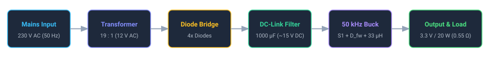
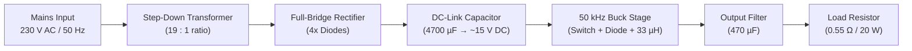

# 230 V AC (50 Hz) to 3.3 V DC (20 W) Power Supply Guide

A complete, beginner-friendly design and simulation tutorial for building an offline switched-mode power supply in **GeckoCIRCUITS**.

---

## 1. Design Overview

| Specification | Target Value | Notes |
| :--- | :--- | :--- |
| **Input Voltage** | **230 V RMS AC**, 50 Hz | European standard mains ($V_{\text{peak}} \approx 325\text{ V}$) |
| **Output Voltage** | **3.3 V DC** | Regulated logic / microcontroller bus |
| **Maximum Output Power** | **20 W** | $I_{\text{out}} \approx 6.06\text{ A}$ |
| **Load Resistance** | **0.55 $\Omega$** | Sized for full 20 W load ($R = V^2 / P$) |
| **Switching Frequency** | **50 kHz** | Period $T_{\text{sw}} = 20\,\mu\text{s}$ |
| **Output Ripple** | **$< 20\text{ mV}_{\text{pp}}$** | Well filtered for digital circuitry |

---

## 2. Block Diagram



```text
┌─────────────────┐       ┌─────────────────┐       ┌─────────────────┐
│   Mains Input   │       │   Transformer   │       │   Diode Bridge  │
│ 230 V AC / 50Hz ├──────►│ 19 : 1 (12V AC) ├──────►│    4x Diodes    │
└─────────────────┘       └─────────────────┘       └────────┬────────┘
                                                             │
                                                             ▼
┌─────────────────┐       ┌─────────────────┐       ┌─────────────────┐
│  Output & Load  │       │   50 kHz Buck   │       │  DC-Link Filter │
│  3.3 V / 20 W   │◄──────┤S1 + D_fw + 33 µH│◄──────┤ 4700 µF (~15V)  │
│  (0.55 Ω load)  │       │ (Duty D = 0.22) │       │ (Smooths 100Hz) │
└─────────────────┘       └─────────────────┘       └─────────────────┘
```

<details>
<summary><b>Mermaid Diagram Source</b> (Click to expand if using the <i>Markdown Preview Mermaid Support</i> extension)</summary>


</details>

---

## 3. Stage-by-Stage Sizing & Calculations

### Stage 1: Mains Input & Transformer
* **Peak Mains Voltage**:
  $$V_{\text{peak}} = 230\,\text{V} \times \sqrt{2} \approx 325.3\,\text{V}$$
* **Transformer Secondary Voltage**:
  Stepping down from $230\,\text{V}$ to $\sim 12\,\text{V}$ AC RMS ($19 : 1$ turns ratio) yields a secondary peak voltage of:
  $$V_{\text{sec,peak}} \approx 12\,\text{V} \times \sqrt{2} \approx 17.0\,\text{V}$$

---

### Stage 2: Rectifier & Intermediate DC Bus
* **Rectifier Voltage Drop**: Two diode forward conduction drops ($\approx 2 \times 0.7\,\text{V} = 1.4\,\text{V}$).
* **Peak Unloaded DC Voltage**:
  $$V_{\text{dc,peak}} = 17.0\,\text{V} - 1.4\,\text{V} \approx 15.6\,\text{V}$$
* **DC-Link Filter Capacitor ($C_{\text{bulk}} = 4700\,\mu\text{F}$)**:
  At full 20 W load ($I_{\text{dc}} \approx 1.5\,\text{A}$ drawn from the intermediate bus), the bulk capacitor must supply current during the $\sim 8\,\text{ms}$ interval between 100 Hz rectifier peaks:
  $$\Delta V_{\text{ripple}} = \frac{I_{\text{dc}} \cdot \Delta t}{C_{\text{bulk}}} = \frac{1.5\,\text{A} \times 0.008\,\text{s}}{4700 \times 10^{-6}\,\text{F}} \approx 2.5\,\text{V}$$
  This keeps the DC bus stiff between **$13.0\,\text{V}$ and $15.6\,\text{V}$** (average $\approx 14.3\,\text{V}$ to $15.0\,\text{V}$), preventing output sag. *(A smaller $1000\,\mu\text{F}$ capacitor discharges by $>12\,\text{V}$, causing the bus and output to collapse to near 0 V at 100 Hz).*

---

### Stage 3: High-Frequency Buck Converter ($50\,\text{kHz}$)
* **Duty Cycle ($D$)**:
  $$D = \frac{V_{\text{out}}}{V_{\text{in}}} = \frac{3.3\,\text{V}}{15.0\,\text{V}} = \mathbf{0.22}\quad (22\%)$$
* **Switching Period ($T_{\text{sw}}$)**:
  $$T_{\text{sw}} = \frac{1}{50\,\text{kHz}} = 20\,\mu\text{s}$$
* **Inductor Selection ($L_1 = 33\,\mu\text{H}$)**:
  Targeting an inductor ripple current $\Delta I_L \approx 30\%$ of full load ($1.8\,\text{A}$):
  $$L = \frac{V_{\text{out}} \cdot (1 - D)}{\Delta I_L \cdot f_{\text{sw}}} = \frac{3.3\,\text{V} \cdot (1 - 0.22)}{1.8\,\text{A} \cdot 50\,000\,\text{Hz}} = \frac{2.574}{90\,000} \approx \mathbf{28.6\,\mu\text{H}} \quad \longrightarrow \text{Select } \mathbf{33\,\mu\text{H}}$$
* **Output Capacitor Selection ($C_1 = 470\,\mu\text{F}$)**:
  For an ultra-clean output ripple $\Delta V_{\text{out}} \le 20\,\text{mV}$:
  $$C = \frac{\Delta I_L}{8 \cdot f_{\text{sw}} \cdot \Delta V_{\text{out}}} = \frac{1.8\,\text{A}}{8 \cdot 50\,000\,\text{Hz} \cdot 0.02\,\text{V}} = \mathbf{225\,\mu\text{F}} \quad \longrightarrow \text{Select } \mathbf{470\,\mu\text{F}}$$

---

### Stage 4: Load Resistor Sizing
* **Full Load Resistance ($R_{\text{load}}$)**:
  $$I_{\text{out}} = \frac{20\,\text{W}}{3.3\,\text{V}} = 6.06\,\text{A} \implies R_{\text{load}} = \frac{3.3\,\text{V}}{6.06\,\text{A}} = \mathbf{0.545\,\Omega} \approx \mathbf{0.55\,\Omega}$$

---

## 4. Component Bill of Materials & GeckoCIRCUITS Settings

| Component | Schematic Name | Palette Category / Hotkey | GeckoCIRCUITS Dialog Parameters |
| :--- | :--- | :--- | :--- |
| **AC Source** | `V_in` | *Sources* / Press **`V`** | `amplitudeAC`: **`325.27`** (Peak = $230\text{V} \times \sqrt{2}$), `frequenz`: **`50.0`** |
| **Transformer** | `TRANS.1` | *Power Circuit (LK)* | `ratio`: **`19.0 : 1.0`** (or primary 230, sec 12) |
| **Bridge Diodes** | `D1`, `D2`, `D3`, `D4` | *Power Circuit (LK)* / Press **`D`** | `rON`: **`0.01`**, `uf`: **`0.7`** |
| **DC-Link Cap** | `C_bulk` | *Power Circuit (LK)* / Press **`C`** | `parameter`: **`4700e-6`** ($4700\,\mu\text{F}$) |
| **Buck Switch** | `S_1` | *Power Circuit (LK)* / Press **`S`** | Coupled to `GATE.1`, `rON`: **`0.01`** |
| **Freewheel Diode**| `D_fw` | *Power Circuit (LK)* / Press **`D`** | `rON`: **`0.01`**, `uf`: **`0.7`** |
| **Buck Inductor** | `L_1` | *Power Circuit (LK)* / Press **`L`** | `parameter`: **`33e-6`** ($33\,\mu\text{H}$) |
| **Output Cap** | `C_1` | *Power Circuit (LK)* / Press **`C`** | `parameter`: **`470e-6`** ($470\,\mu\text{F}$) |
| **Load Resistor** | `R_load` | *Power Circuit (LK)* / Press **`R`** | `parameter`: **`0.55`** ($\Omega$) |
| **PWM Generator** | `PWM_GEN` | *Control* → *Signal Sources* | `frequenz`: **`50000.0`**, `tastverhaeltnis`: **`0.22`** |
| **Gate Driver** | `GATE.1` | *Control* → *Coupled Control* | Coupled Switch: Select **`S_1`** |
| **Oscilloscope** | `SCOPE.1` | *Control* → *Sinks* / Press **`O`** | Signals: **`V_out`**, **`I_L`** |

---

## 5. Step-by-Step Canvas Construction

```text
                (Rectifier)                         (Buck Power Stage)
                  D1    D2                      S               L (33µH)
  [Transformer]--+--|>|-+--|>|--+---(15V)------/ ---------+------mmmmm------+------ (3.3V Out)
  (19:1 ratio)   |      |       |                         |                  |
                 +--|<|-+--|<|--+                         |                  |
                  D3    D4      |                       --+--              --+--
                              ===== C_bulk               / \  D_fw       C_1 =====  [ R_load ]
                              ===== (1000µF)            /---\ (Cathode     =====   [ 0.55Ω  ]
                                |                        ---   on top)       |     [ (20W)  ]
                                |                         |                  |         |
  (Ground 0) -------------------+-------------------------+------------------+---------+------
```

### Keyboard & Mouse Shortcuts
* **Rotate component while moving**: Press **`R`** or right-click.
* **Start wiring**: Click on any terminal pin (highlighted in cyan).
* **Finish wire**: Click destination pin, or click an existing wire to drop a **T-junction tap**.
* **Abort wire**: Press **`Escape`** or right-click.
* **Open Properties Panel**: Click or double-click any component.

### Step 1: Mains & Transformer
1. Place the AC Voltage Source `V_in` vertically on the left.
2. Place the Transformer `TRANS.1` directly to the right. Wire `V_in` terminals to the transformer primary input pins.

### Step 2: Bridge Rectifier & DC-Link
1. Place 4 diodes arranged as a standard bridge:
   * Two top diodes (`D1`, `D2`) pointing towards the top positive DC rail.
   * Two bottom diodes (`D3`, `D4`) pointing away from the bottom negative rail.
2. Connect transformer secondary pins to the bridge AC nodes.
3. Place `C_bulk` vertically between the positive rail and the ground rail.

### Step 3: Buck Converter Power Train
1. Place `S_1` horizontally on the top positive rail.
2. Place `D_fw` vertically: anode to ground, cathode to the switch node between `S_1` and `L_1`.
3. Place `L_1` horizontally immediately after `S_1`.
4. Place `C_1` vertically after `L_1` to ground.
5. Place `R_load` vertically after `C_1` to ground.

### Step 4: PWM Control & Scope Probing
1. Place `PWM_GEN` and `GATE.1` in the control region below.
2. Wire `PWM_GEN` output pin to `GATE.1` input pin.
3. Open `GATE.1` properties: assign its coupled switch to `S_1`.
4. Place `SCOPE.1`:
   * Wire Channel 1 to the top of `R_load` (label net as `V_out`).
   * Insert an ammeter probe or connect Channel 2 to monitor `I_L`.

---

## 6. Simulation & Verification

### Settings Setup
Click the **Gear icon (⚙)** or **Simulation ▾** in the top bar:
* **Duration**: `0.05` s (50 ms, corresponding to 2.5 full 50 Hz line cycles).
* **Time Step ($\Delta t$)**: `1e-6` s ($1\,\mu\text{s}$).

### Running the Simulation
* Press **`F5`** or click the green **Run (▶)** button on the top toolbar.

### Expected Results in Scope View
1. **Output Voltage ($V_{\text{out}}$)**:
   * Starts at $0\,\text{V}$, smoothly charges $C_1$, and settles at **$3.30\,\text{V} \pm 15\,\text{mV}$**.
2. **Inductor Current ($I_L$)**:
   * Continuous triangular ripple centered around **$6.06\,\text{A}$** with peak-to-peak ripple $\Delta I_L \approx 1.8\,\text{A}$ ($5.2\,\text{A} \to 7.0\,\text{A}$).
3. **Delivered Output Power**:
   $$P_{\text{out}} = V_{\text{out}} \times I_{\text{out}} = 3.3\,\text{V} \times 6.06\,\text{A} \approx \mathbf{20.0\,\text{W}}$$
